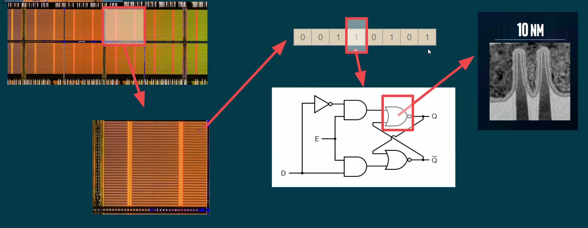
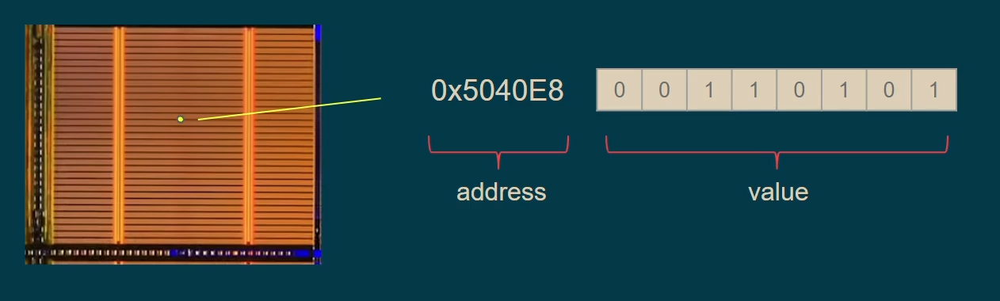
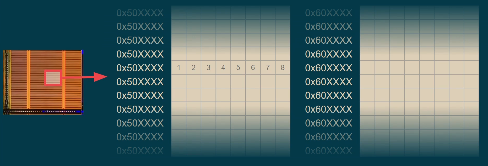
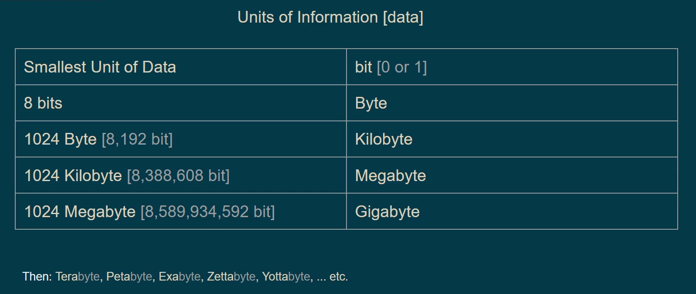
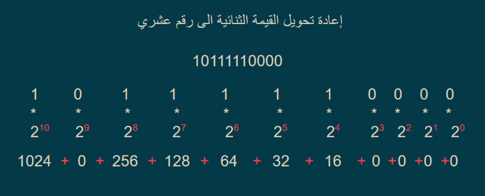
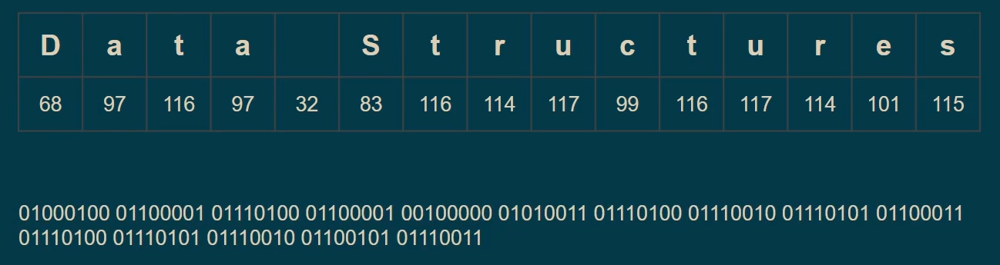

## Data & Memory

First of all, Data is being manipulated by <mark>**Disk**</mark> and <mark>**Memory**</mark>.

- <mark>**Address**</mark> is not allocated in somewhere in the storage or memory, it's like "shop queue", we know the third person, by "counting".

### All data basically is </mark>**Binary Data 0/1**</mark>.

> - 1 is True.
> - 0 is False.
> - 1 unit of memory = 8 memory cell, interchangeably, some cells could be 1 and the rest are 0.

>   

> 

> - Any data whatever it is, it could be converted to binary.
> - To convert any number to binary, we divide the number by 2, and take the remainder which is 1 or 0, and the binary number is from bottom to top.
> - To vise versa 

> To store data that's 11bit in a storage desk 16bit, we add 5 zeros at the left of the binray number
> 00000101 11110000

> To convert Text, we have "ASCII" and "Unicode".
> 

> Colors, we have Hex color code, and each code is text and then converted to binary.

> Images, each pixel of an image is a color, and then colors to Hex to binary.
