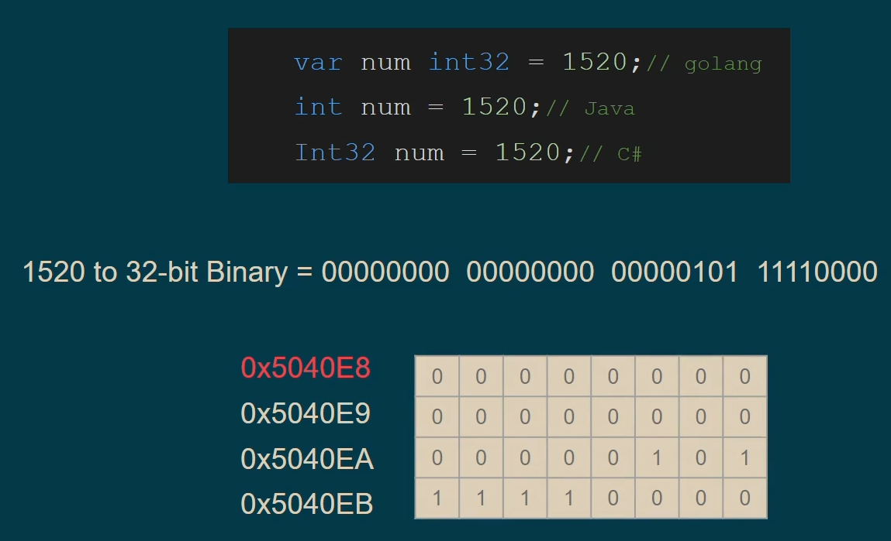
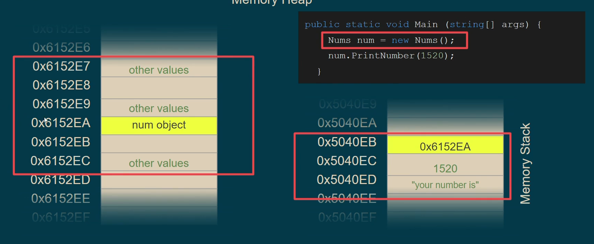

## DataTypes & Memory

- Each datatype takes space of memeory and has its own address, we have to consider how much this variable should take from the memory, <mark>**it would be a bad idea to give it a space that's bigger than it should be.**</mark>

- With that being said, you should know what is your limit if you going to declare a variable to make the best out of your memory.

- a variable with one value can takes 2 places (16bit) from the memory with 2 addresses, the first address is considered rather the second or any else.

> 

- When it comes to **Pointers**, it's not recommended and usually if there are pointers in the code it should be in a scope that's called **"Unsave"**, because when it comes to work with memory by yoursef you can shoot yourself in your foot!!

> - Pointer is a Data Type, holds an address for a variable.
> - The address is the index of the memeory location in the memory matrix.

### Stack (Memory Stack)

> Memory is a matrix of storage units, Stack is no deference but kind of a special part of the memory that we make use of it in a special way, and so that it called a **Stack**.

- Last In First Out (LIFO)

When a fucntion is being called:

- Create or store the function variable into the memory
- After the function call is finished, the variables or data will be deleted from the memory vise verse (LIFO).

> If there's a **recursion**, when the function is being called again, here a "Stack Frame" or "Activation Record" will open, which call the function again with another data and so on till all is being deleted.

> These steps and how the memory treat the data, <mark>**that's the Stack**</mark>.

- Stack is **not a physical memory place** it's a **Logical place**, all memroy is no deference, where specific addresses are reserved for Stack and other for Heap and so on, and each one of these has its own special way of dealing with data.

### Heap (Memory Heap)

> Again, Heap, Stack, all is no deference, all is memory.

- Data is not stored one after another or not ordered.

- Any data in the Heap, its address should be stored in the Stack.

- Heap is what you expect from the memory

- each programming language determines what to store in Stack or Heap automatically, and sometimes it's up to you.

> 

> ![NOTE]
>
> - Memory Stack & Heap are NOT Data Structures.
> - Just regular places in the memory treated differently.
