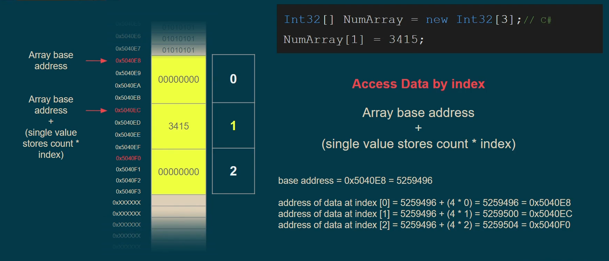
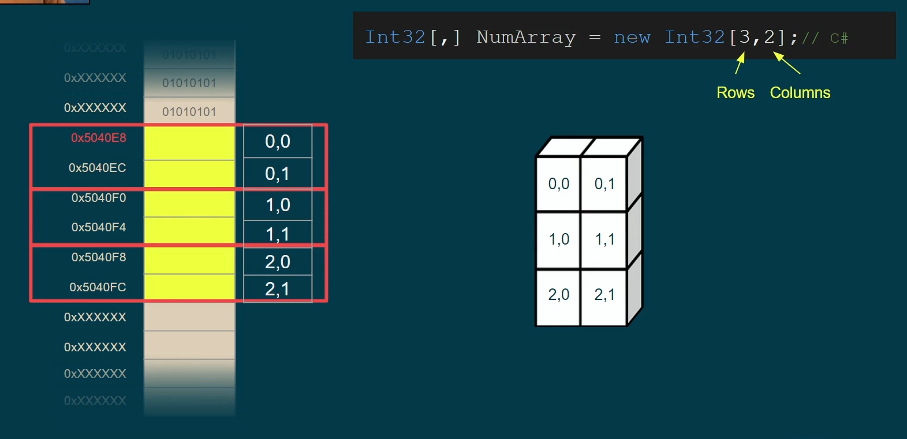
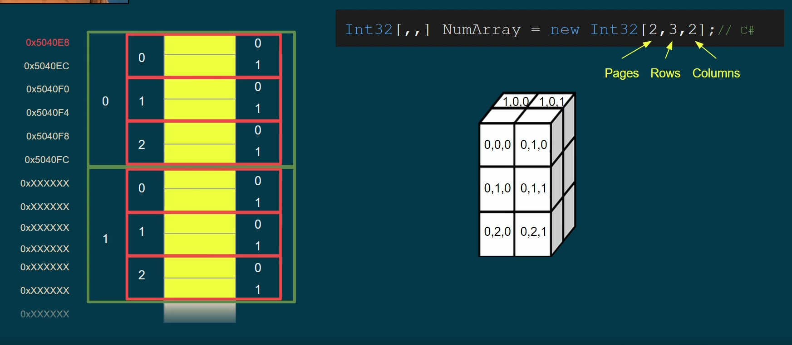
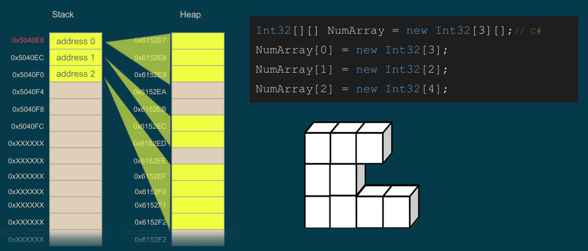
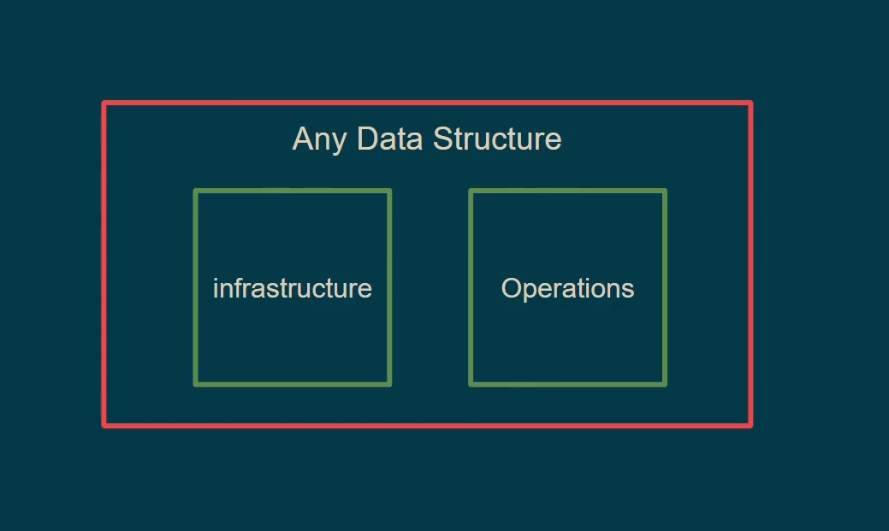
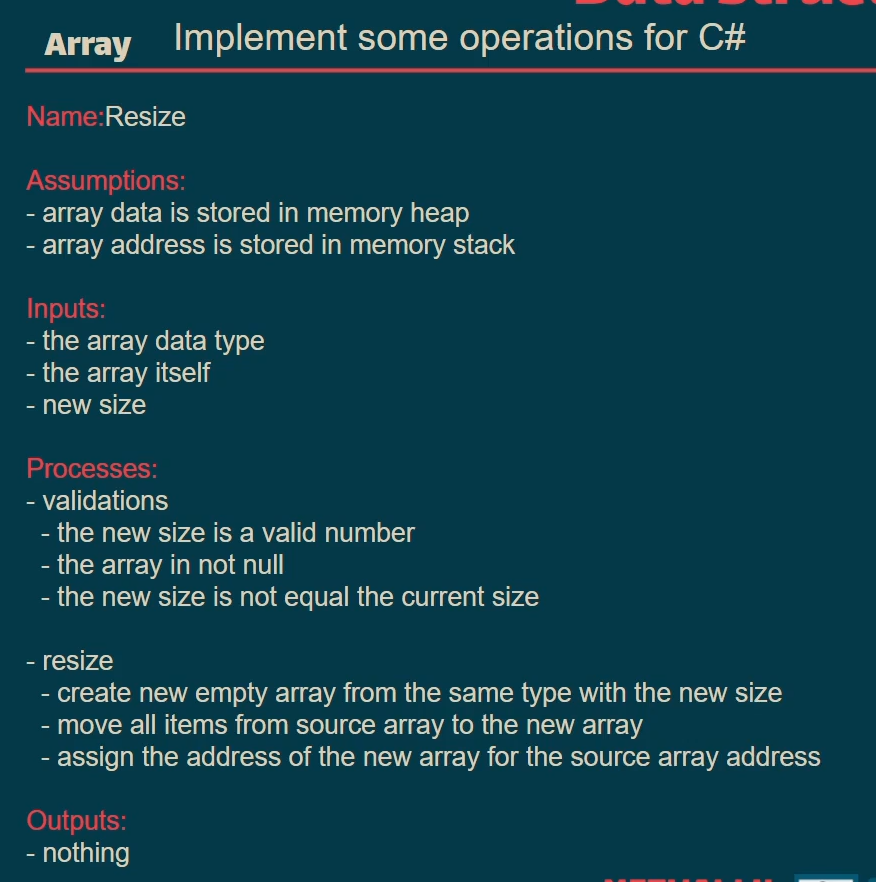
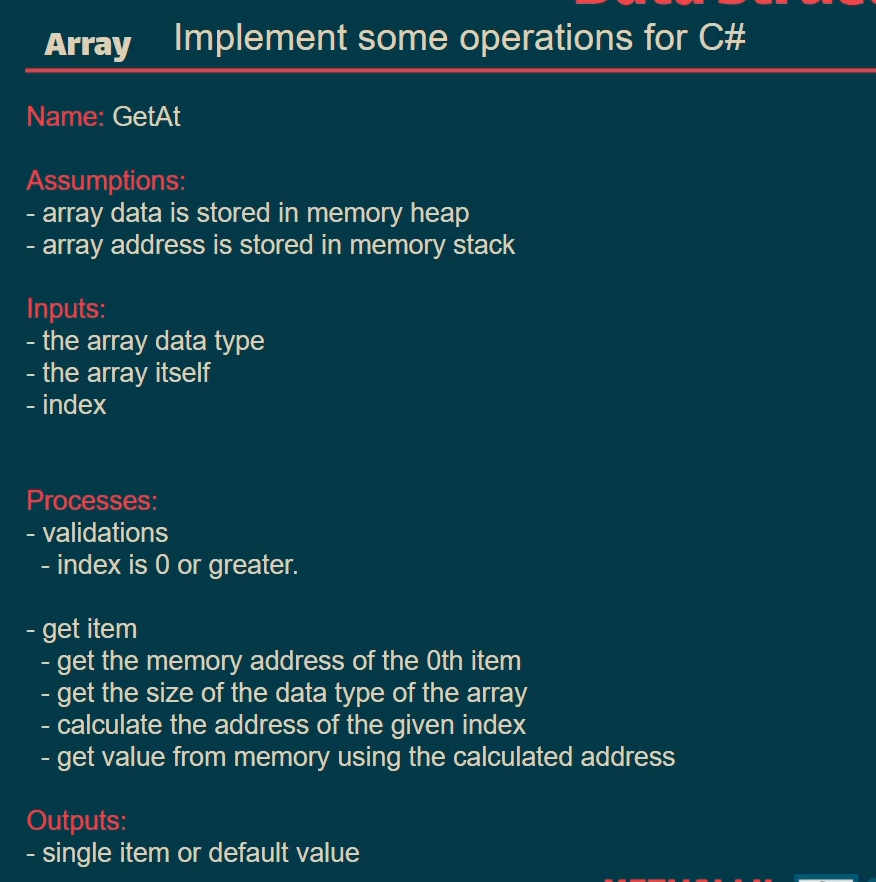

## Array

> 

### Why Do Arrays Start at Index 0?

While some programming languages use 1-based array indexing, it is standard practice to start indexing at 0. This approach simplifies the indexing process and minimizes additional calculations that would be required if indexing started at 1. Starting at 0 makes array access more efficient and aligns with underlying memory management in most programming languages.

> which is better, 1-based or 0-based? -> It doesn't matter!

> ![NOTE]
>
> - On declaring an Array we must know its **size**
> - So far, you should know why yourself, partially because of the indexing that needs all data to be close and one after another
> - A dynamic array is not truly "dynamic" in the literal sense. Behind the scenes, there is logic somewhere that automatically resizes the array by copying the existing data into a larger array when needed. Additionally, algorithms are used to estimate or approximate the likely increase in size based on usage patterns, ensuring that the array can accommodate future data efficiently.

### Array Types

- Regular Arry
- 2D Array
- 3D Array
- Jagged Array (Array of Arrays)

> In 3D arrays, when there are many layers of rows and columns, this is often referred to as a "page."

> 2D arrays length = rows \* colmuns.
> 

> 3D arrays, the overall length is not fixed, as each dimension can have a different length, but we can calculate it same as 2D.
> 

### Where Are Arrays Stored: Stack or Heap?

The storage location of arrays depends on the programming language. Some languages store arrays directly in the stack, while others place them in the heap and store their address in the stack. Additionally, certain languages allow you to choose or modify its default behavior.

- **In 3D Arrays, you MUST store its adderss in the stack, and its value in the heap.**

> In this example, we aim to reserve three memory slots to store addresses (using placeholders for now), and we know the length of these pointers or addresses on the run time.
> 

### What is Data Structure?

Any data structure consists of two key components: infrastructure and Operations.

- Infrastructure: it's the physical way to store any data. (<mark>**Compiler responsability**</mark>)
- Operations: Any actions that can be performed on that data structure. (<mark>**Our responsability**</mark>)
  - Static Operations: Actions that don't modify the infrastructure, such as accessing or traversing elements.
  - Dynamic Operations: Actions that modify the infrastructure itself, such as inserting or deleting elements.

> 

> [!NOTE]
>
> - Infrastructure which is the compiler responsibility like to reserve places of the memory and give back its addresses, this proccess takes lots of line of code and lots of instructions to be done it
> - Opreations which is our responsibility, the point here is that we can manipulate or add more operations, so that we call it our responsibility.

### Implementing Array Operations

> [!IMPORTANT]
>
> - For simplicity's sake, we are making assumptions here, but in real-world scenarios, the code should handle all possible cases. In the algorithm course, we assumed that the data would arrive as expected, but in practice, you need to validate and manage all potential situations.
> - It's more effective to follow **systematic or structured approach** such as using templetes or writing algorithm before coding, it's better than Stream of Consciousness.

> [!TIP]
> Before using any method or function for arrays or memory manipulation, it's crucial to thoroughly understand it. Built-in methods or functions might involve more operations and validations than needed for your specific scope or may not behave as expected, whereas a simple for loop could often be more efficient.

>  > 
