## Singly Linked Lists

A Singly Linked List is a data structure consisting of a sequence of items (objects or nodes), where each item contains data and a pointer (reference) to the next item (node) in the sequence.

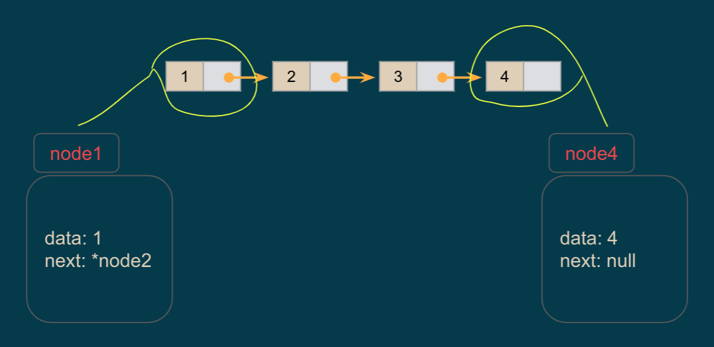

> How the node looks like? 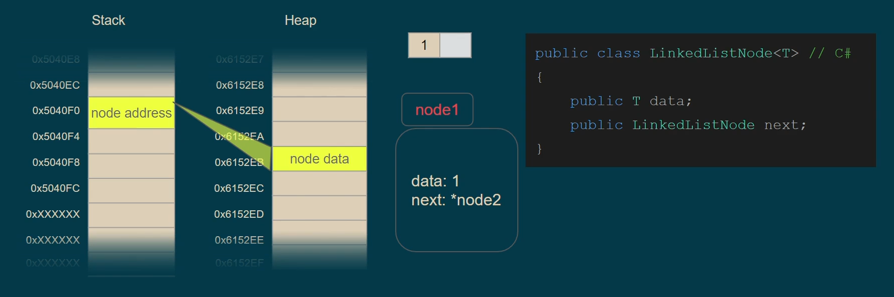
> Linked list infrastructure and operations 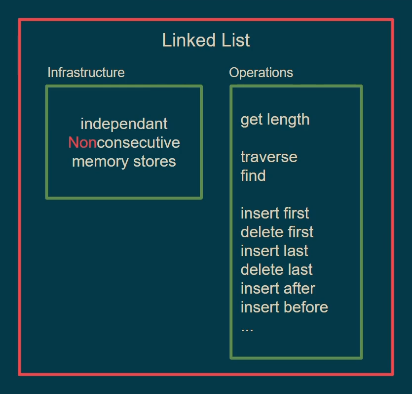 > 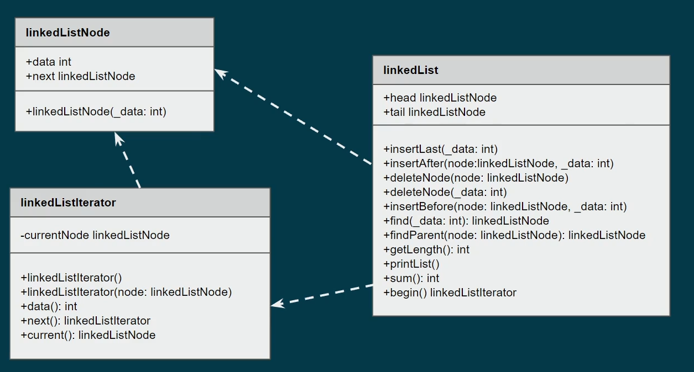

### Singly Linked List Implementation

> 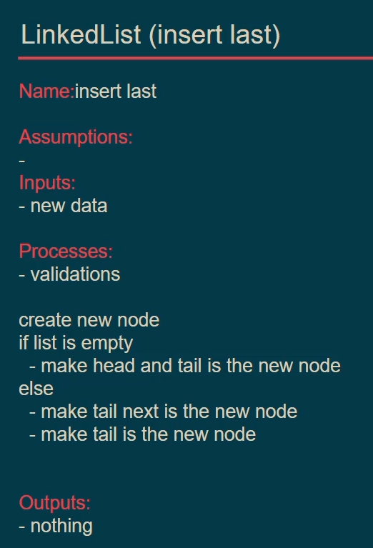

> 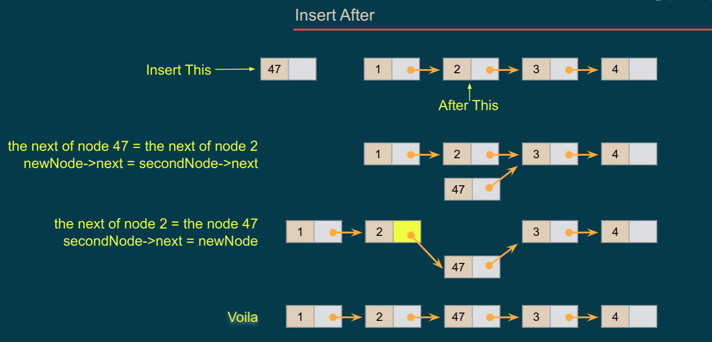 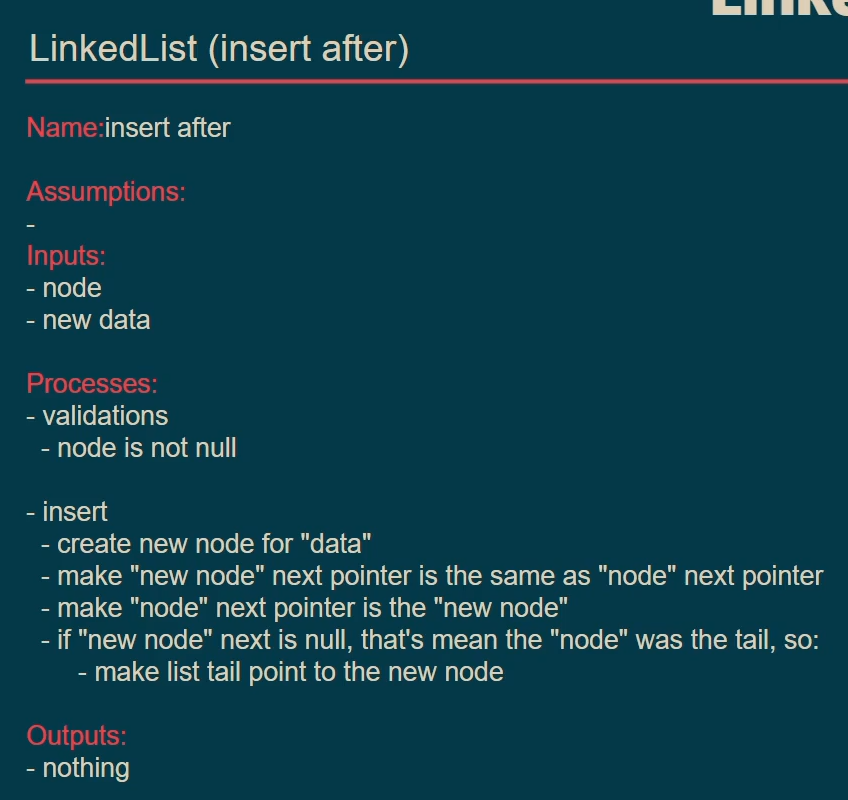

> [!TIP]
> If you are working with Linked lists or do operations on them, its preferred to visualize or draw (pen and paper) the items and then use this drawing to write the steps or algorithm or **the code itself**.

> 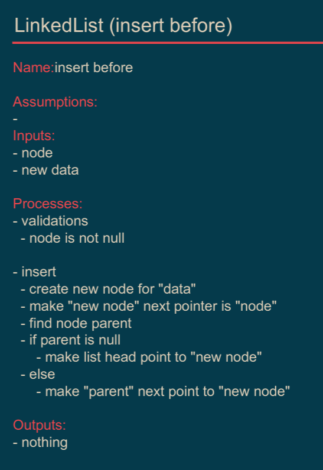 > 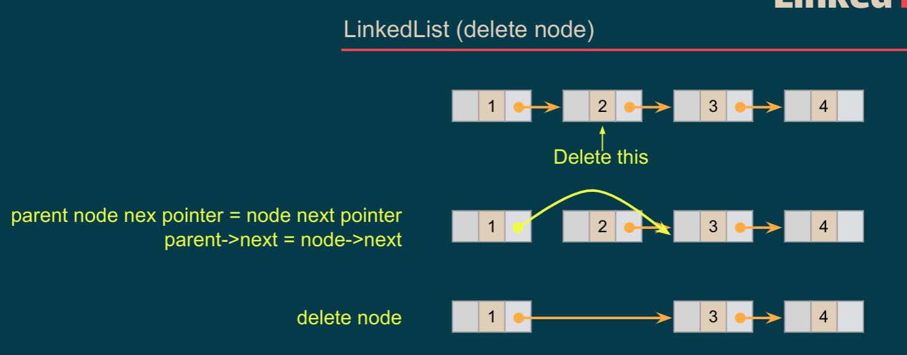 > 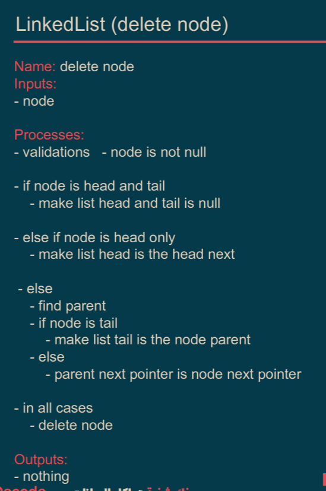

## Doubly Linked Lists

Similar to a Singly Linked List, **However**, it has two pointers: one pointing to the next item and another pointing to the previous item in the sequence.

> Here we can call it: back, previous or parent .. etc.

> 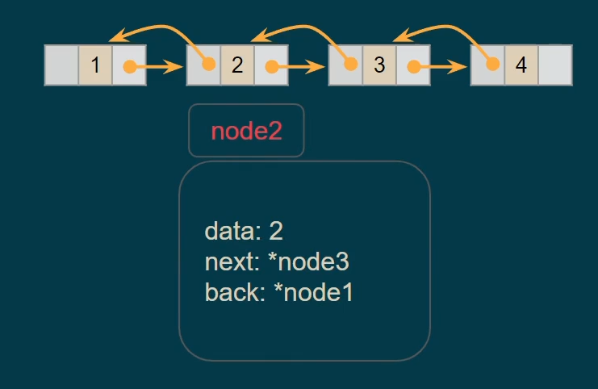

> - Unlike Singly Linked Lists, in the node we add pointer to the back or previous node.
> - And we remove findParent because we already have it in the node itself.
>   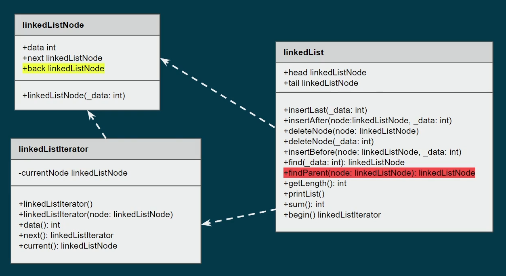

> **Insert after** 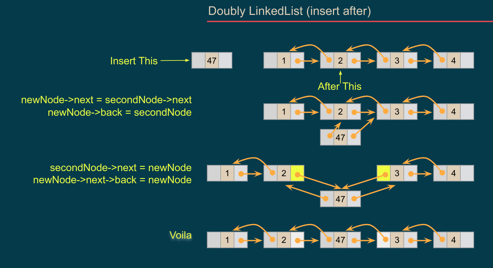 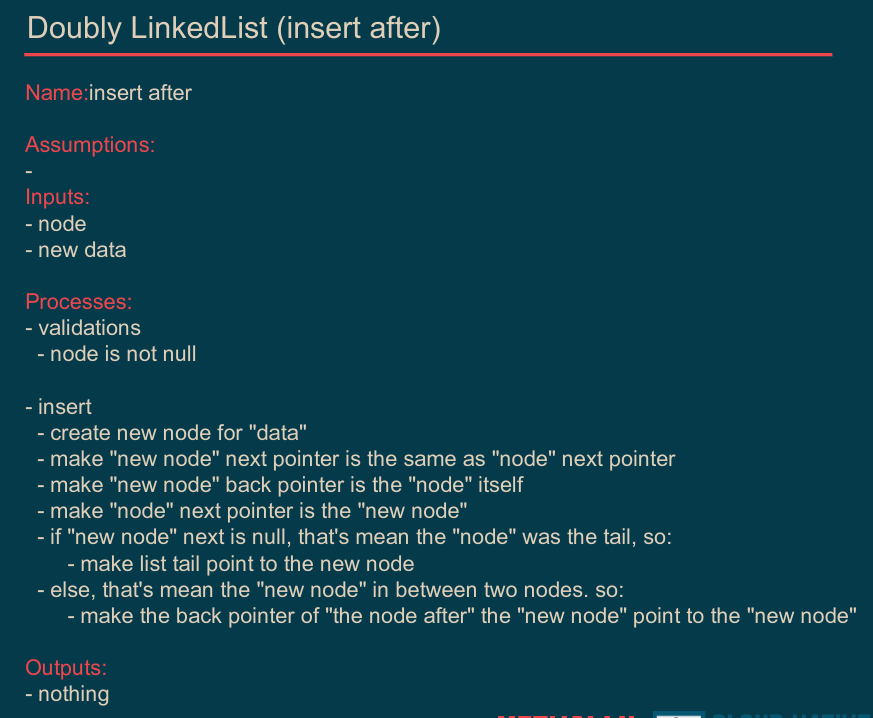

> **Insert last** 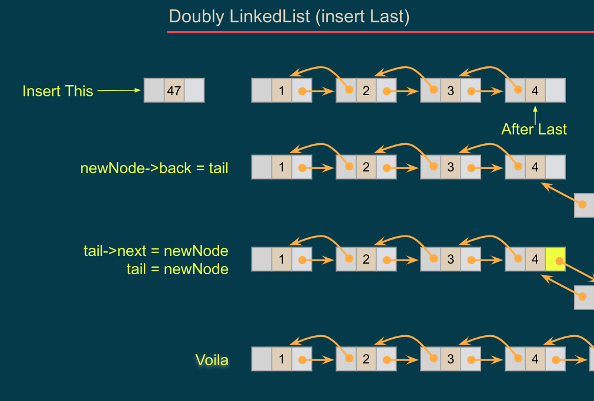 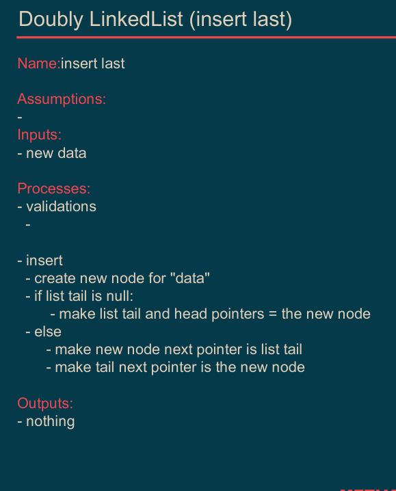

> **Delete Node** 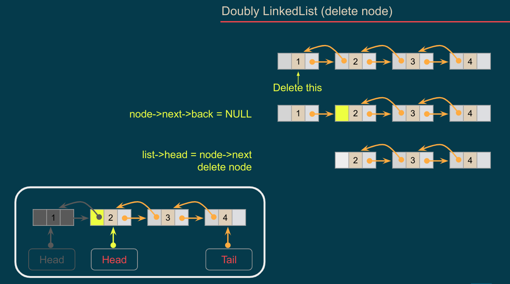 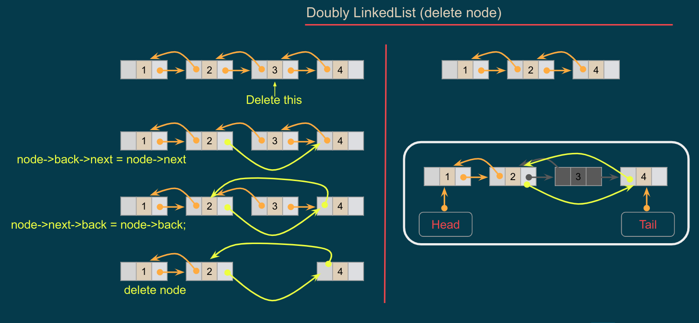 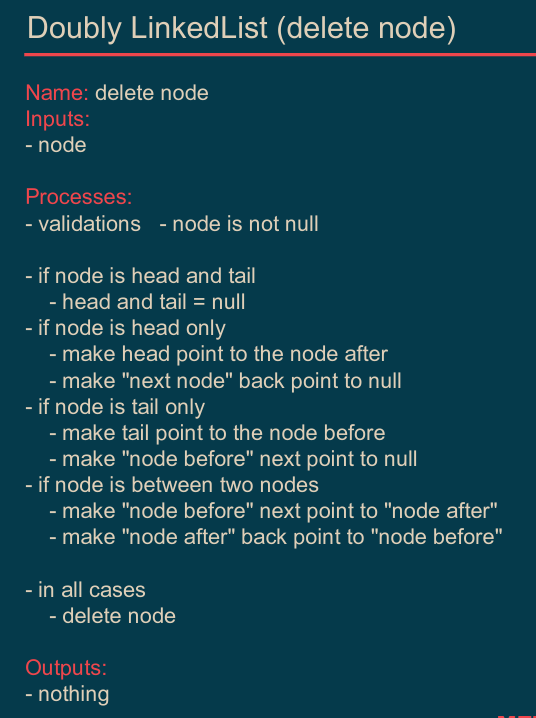

### Exercises

- Use Generic Types (to accept any data type).
- Get length from property not from function (update when delete or insert).
- Copy List (to new list not to assign the address).
