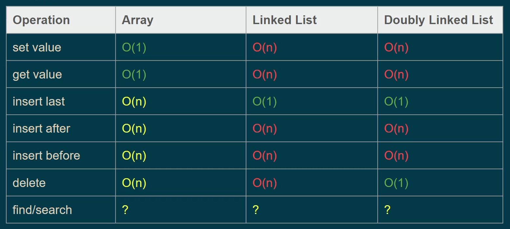
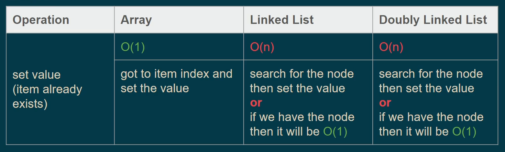
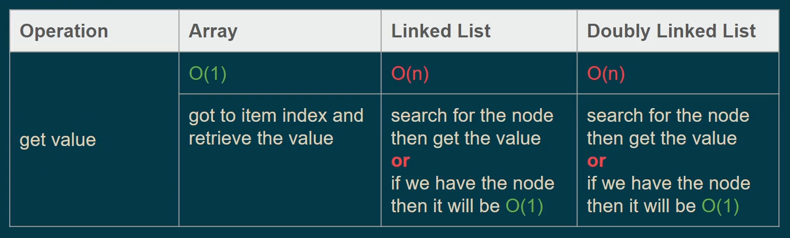
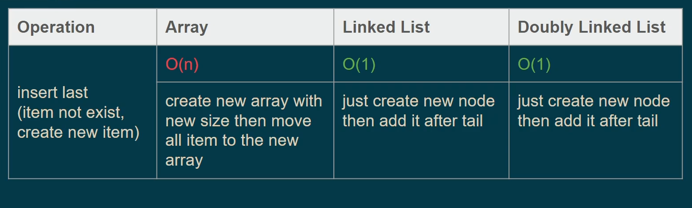
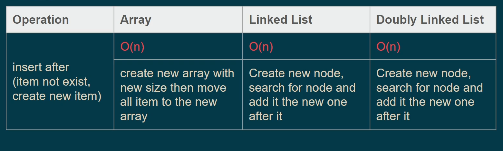
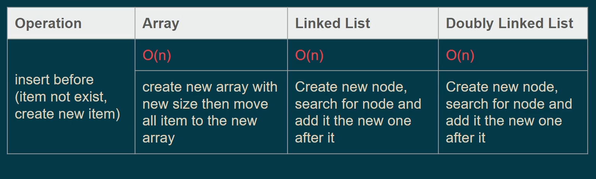
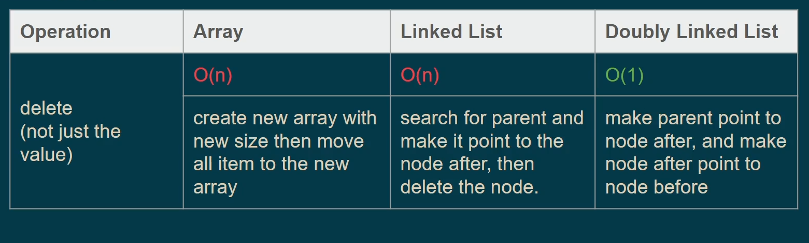
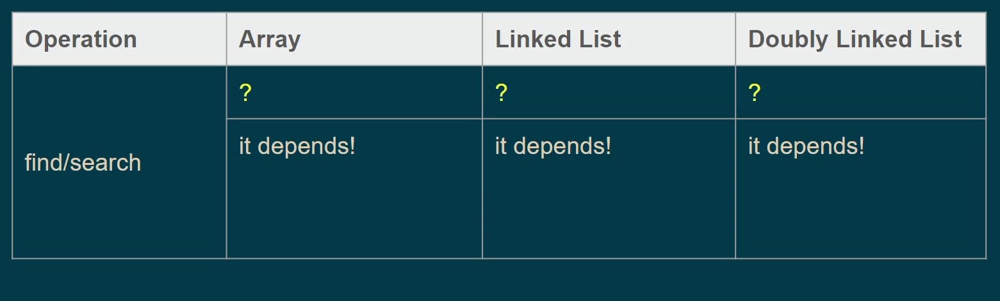
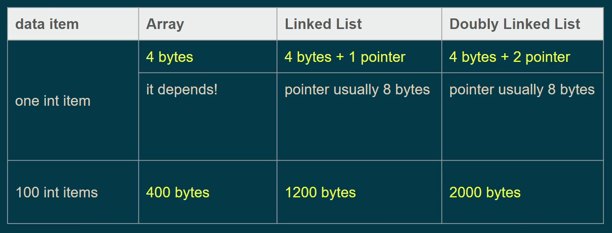

## Array VS Linkedlist (Time Complexity)

       

### Array VS Linkedlist (Space)

> According to some information you have and to the operations that will be applied, it's up to you to determine which is the best fit data strcuture, it's not about that the array is the best as it take small space, it's determined by a **specifc Criteria** ...
> 
