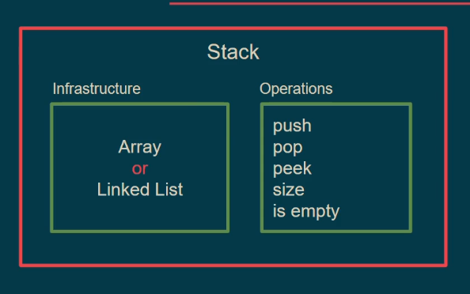

## What Makes Stack a Stack?

- we have data and container
- we can add data from one direction **(ordered)**
- we can read only the top data
- to read other data we have to remove top data (LIFO/ FILO)

> 

