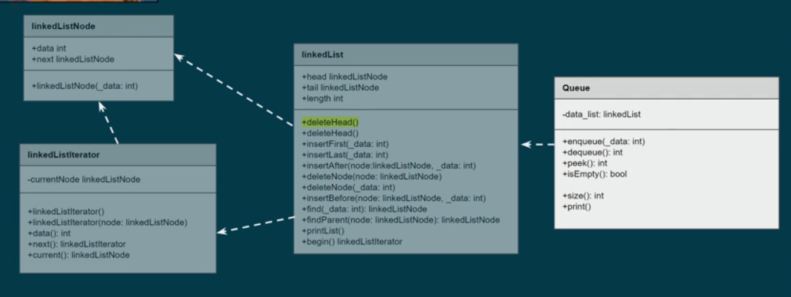

## How it works (Simple Queue)

- We have data and container (data structure)
- Data in from one direction whatever it is and out from the other direction (FIFO)
  
  
- we can access only the data which is the first one entered, or in other words الي عليها الدور :)
  

### Why queue has all these restriction?

- If you want no restrictions and any operation is allowed, so you are not need data structure, just use Array and all things fine!

- Partially, because we FORCE myself and anyone will use the code to not to use it in a wrong way or not to make mistakes, the type of proccessing on the data needs specific data structure to guarantee that the output is correct and all things are fine

- Your application might have to use the FIFO approach to proccess the data

> [!NOTE]
> Be sure that any approach or data structure is like a solution in the software, this one of the solutions in the software industry, solutions that we have guaranted that they work correctly so that we can use it without doubt!

