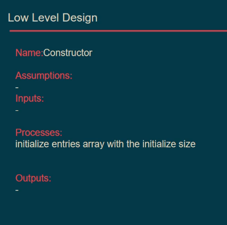

## Dictionary

- a Dictionary is a collection of Key Value Pairs
  - all keys from the same type
  - all values from the same type
  - accessing any key anytime
  - accessing the value with its key only

> This diagram is one of the **UML diagrams** called actitvity diagram (start **study** uml with it)

