## Hashing

The practice of transforming a given key or string of characters into another value for the purpose of security. Unlike standard encryption, hashing is always used for **one-way encryption**, and hashed values are very difficult to decode.
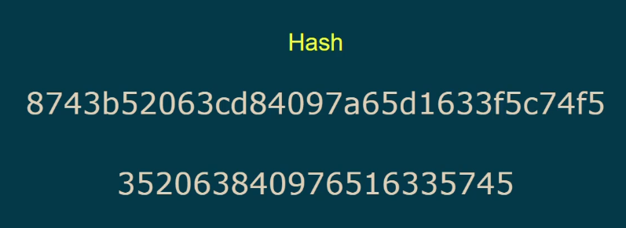

- it's **not an encryption** excatly

> Hash Function: The function that turns input into a hash  
> 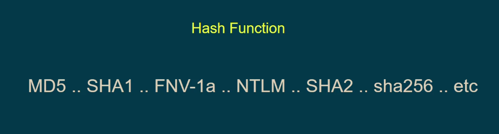

> The simplest known Hash function
> 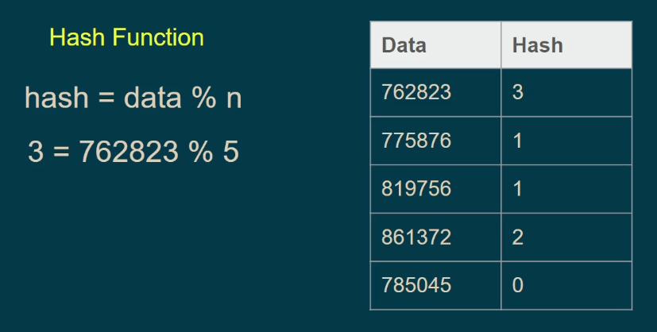

### Terms

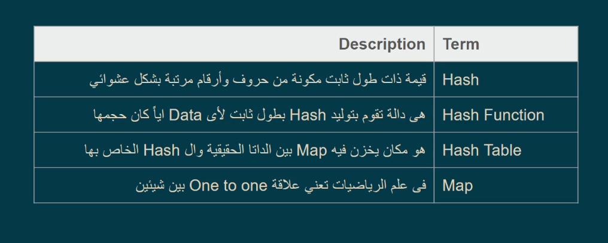

### Notes

- This is a Hex decimal output function (hash 32): which is each 2 value is 1 Byte
  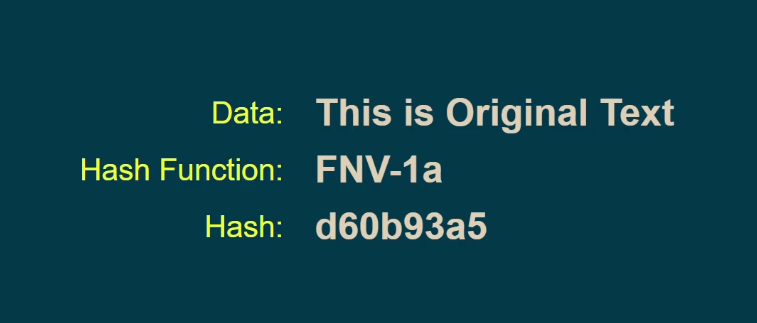

- Hash is **Case Sensitive**: any simple change will change the hash value
  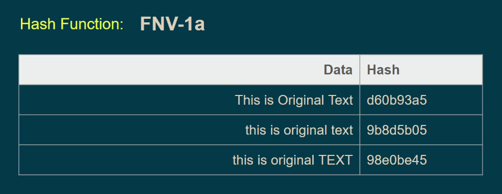

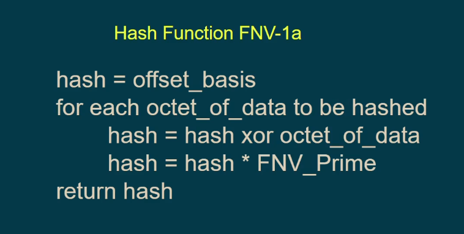
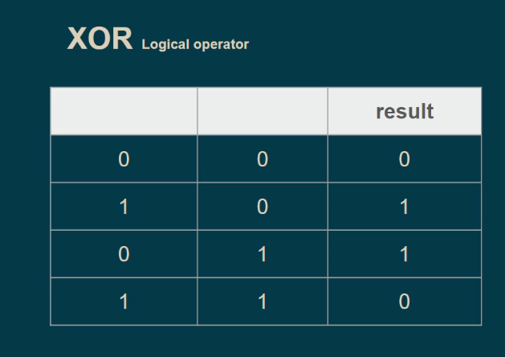
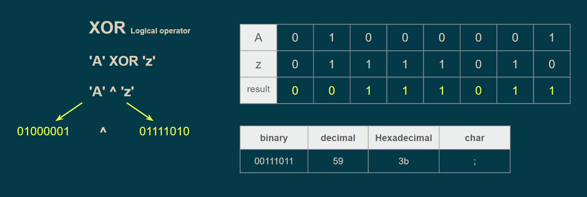

### Collision

If the hash function takes deferent inputs but output the same hash
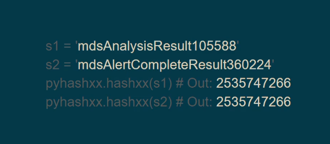

## Hashing Usage

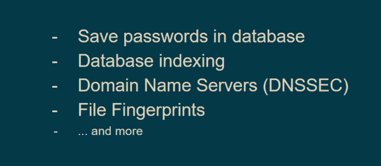
