## Hash Table

Is a dictionary or **KeyValue** Pairs put with a twist.

- It's preferred **not mandatory** to make all keys and values from the same type

This is the activity diagram for the dictionary set function, the twist here is that with hash table **we can make "search for key" process to be o(1)**
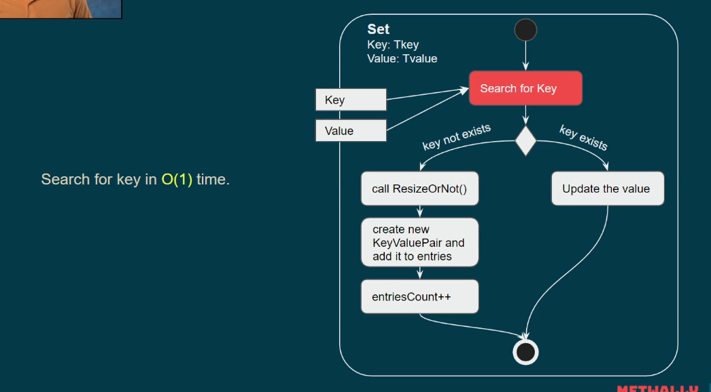

hash table mechanism is from the key itself we can know its place or where it should be placed, this can be done by the normal hash function that uses the modulus (%)
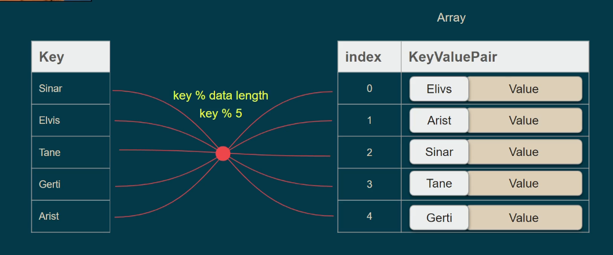
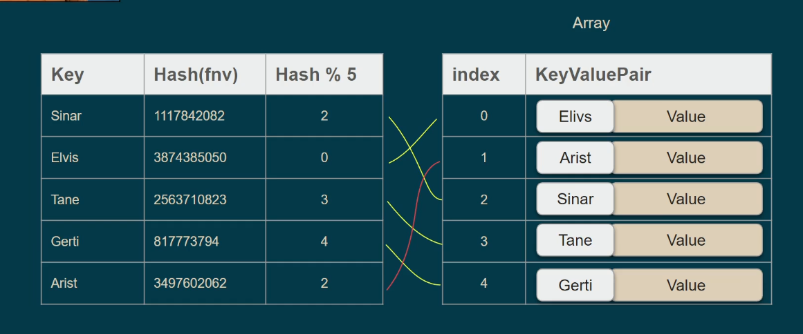
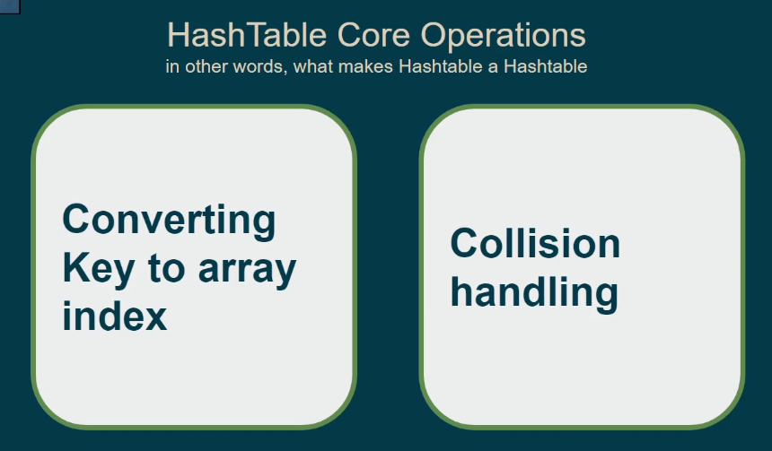

## COllision Handling

- Linear Probing
  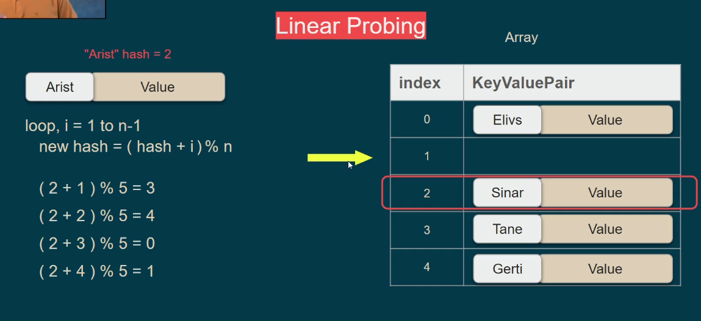
- double-probing.png Probing
  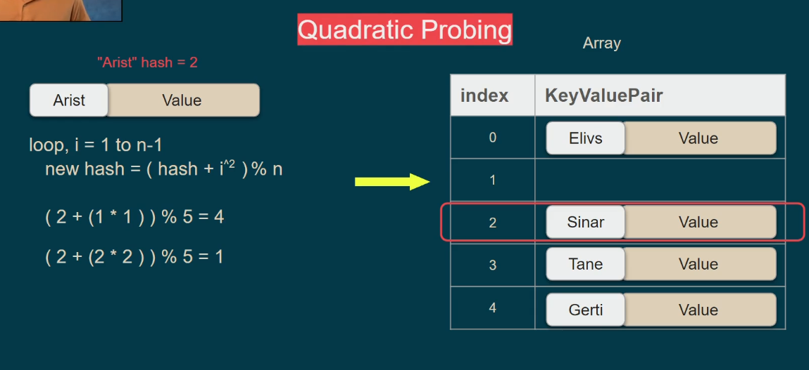
- Double Hashing: orange color is hash2
  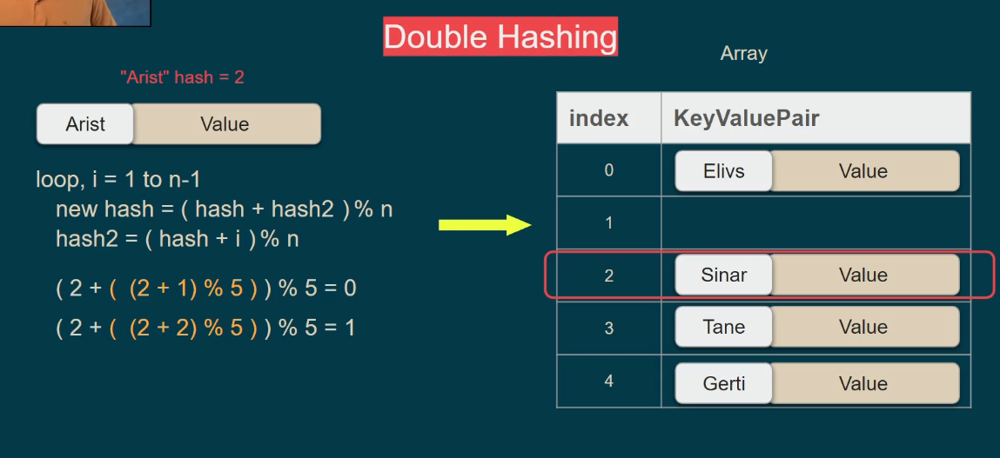
- Separate Chaining: make it a linked list, easy!
  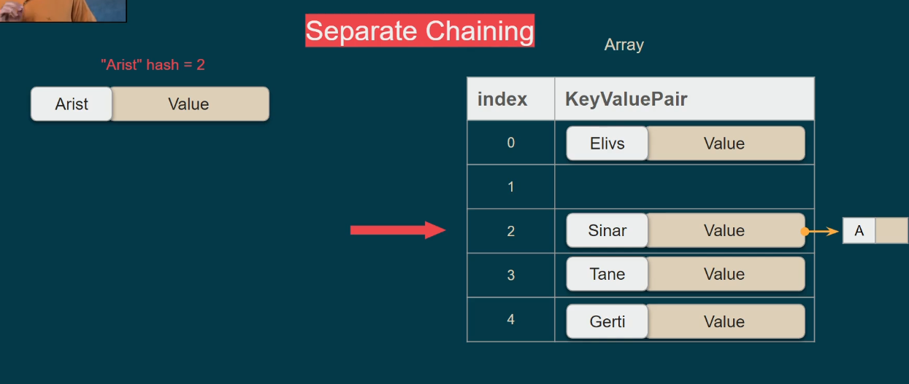

### Open/Closed Addressing & Open/Closed Hashing

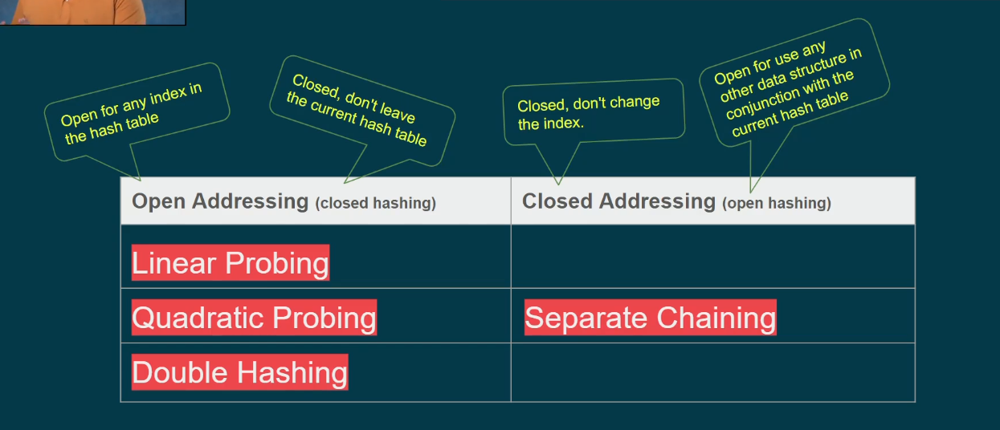

### Implementation

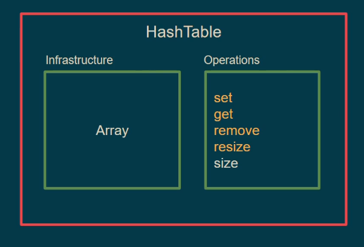
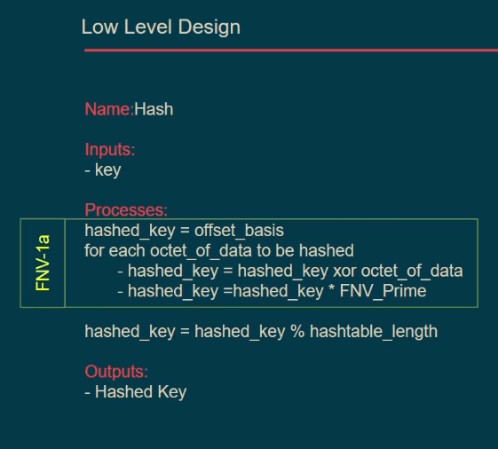
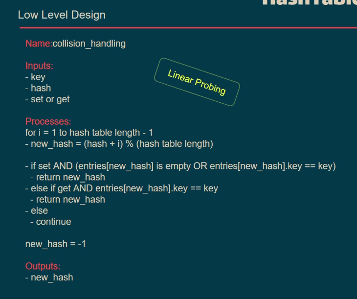
set
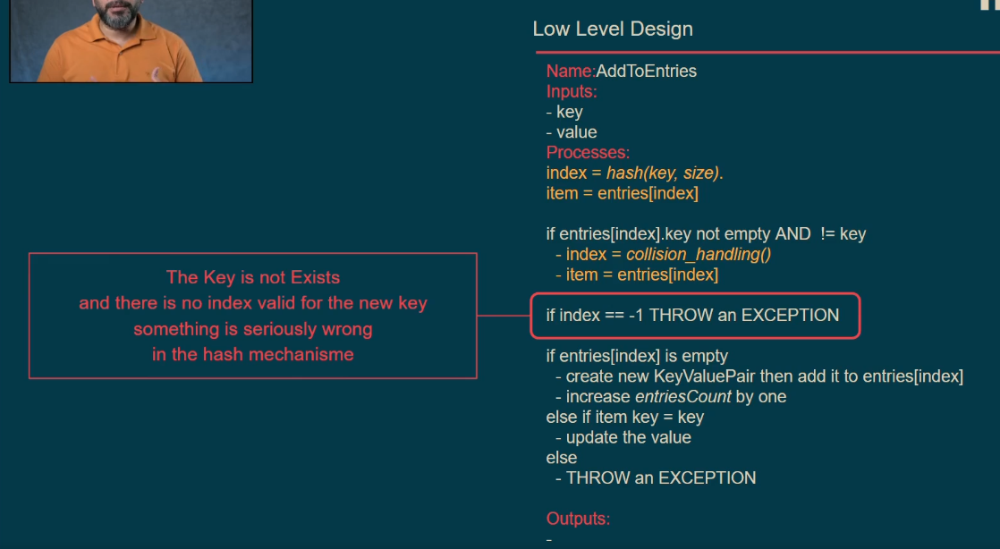
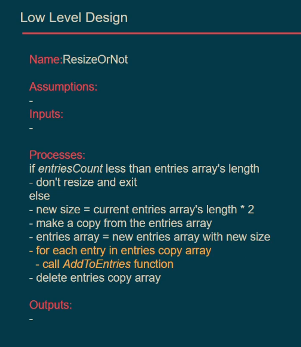
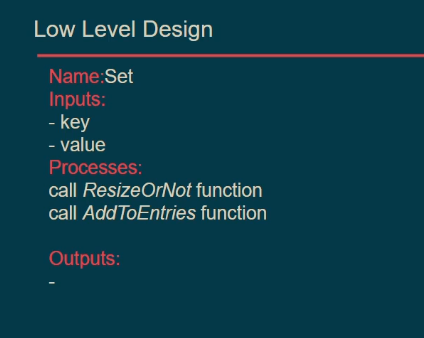

Note: it's just not recommended but you can use it, it's like recurison, and here we have a base case in the below image to break the loop or clog infinity call.
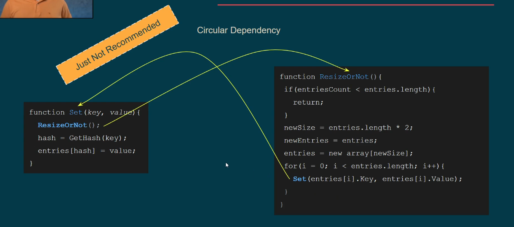

Here's the solution
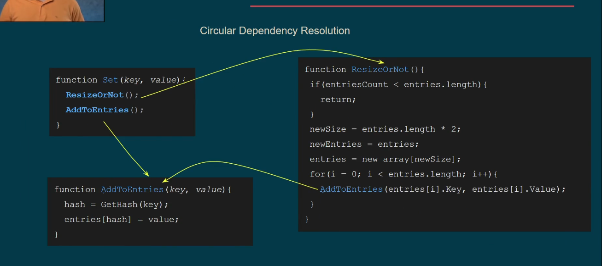

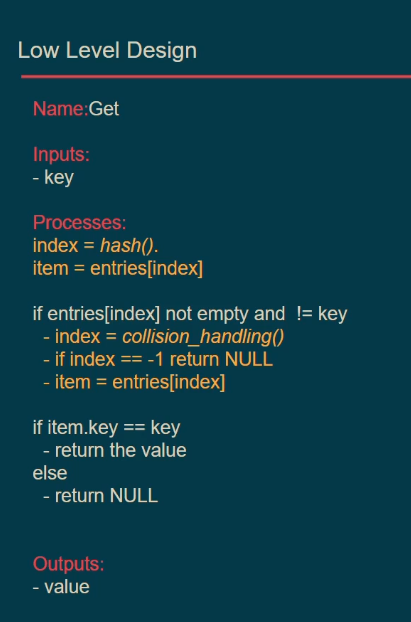
