## Trees

- Binary Tree
- Binary Search Tree
- AVL Tree
- B-Tree
- T-Tree
- Splay tree
- Syntax Tree
- Treep
- GGM Tree
- ...

### General Tree

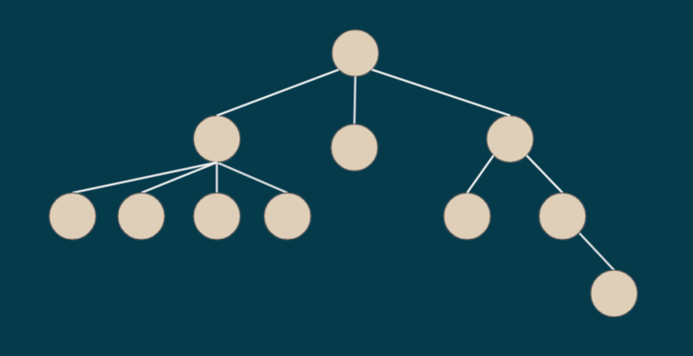
Ex: File System

## Binary Tree

Each item (node) has 2 items(nodes) ONLY (Binary), it might has less or nothing but not more.
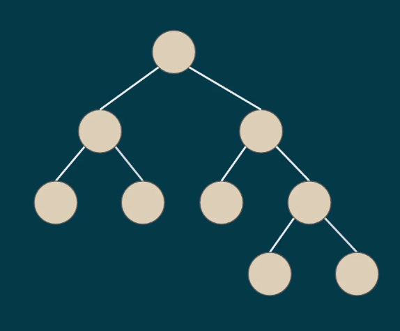
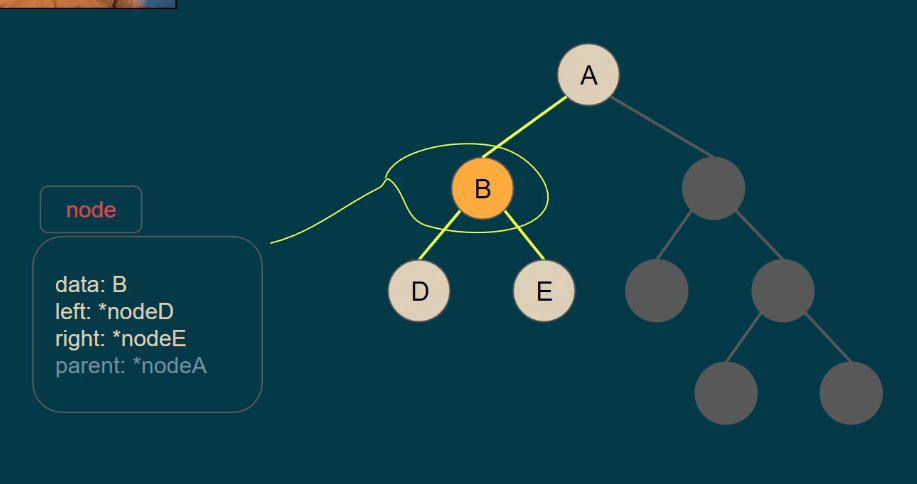
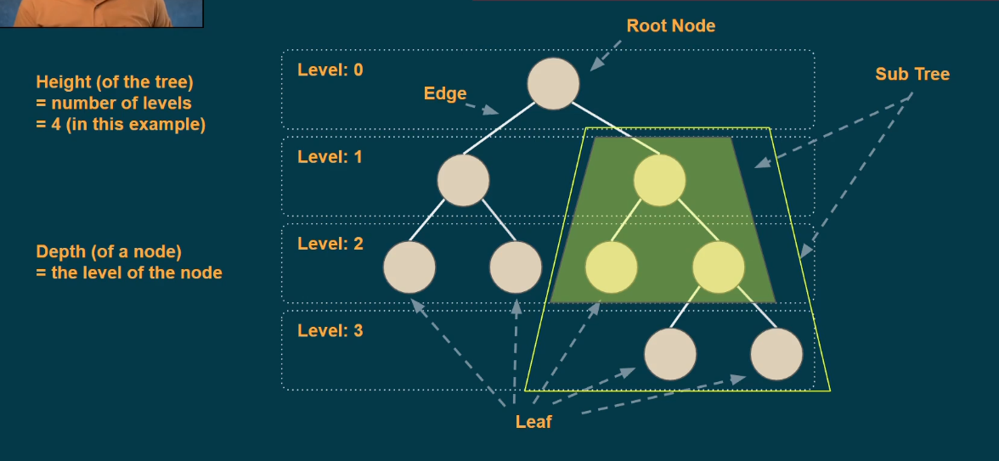
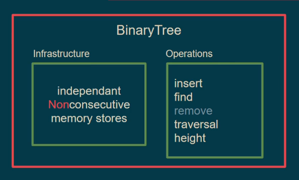

Traversal
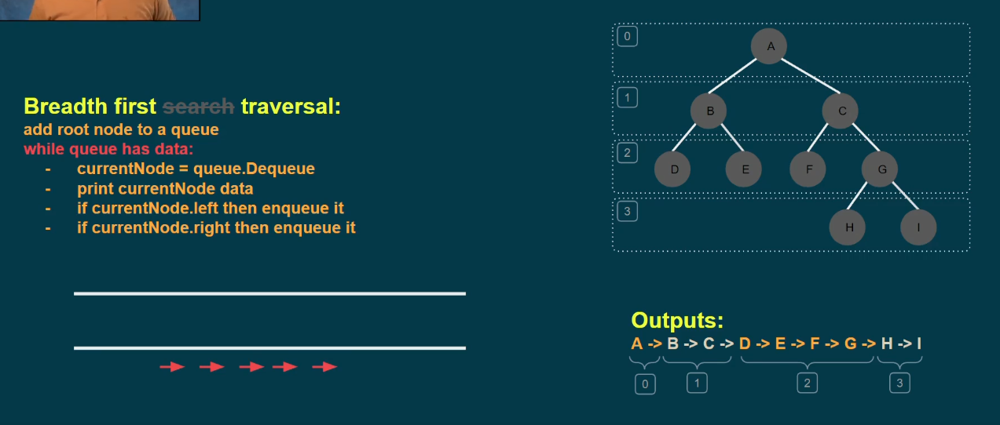

Class Diagram
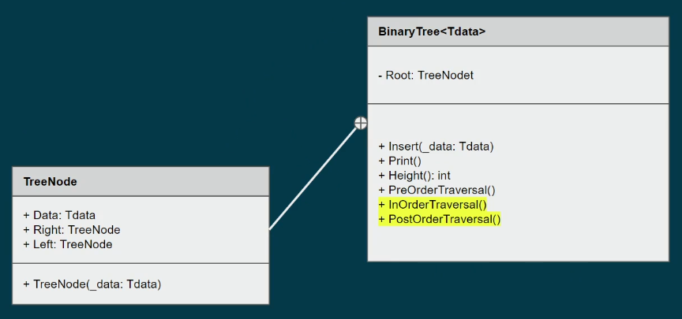

Insert Data
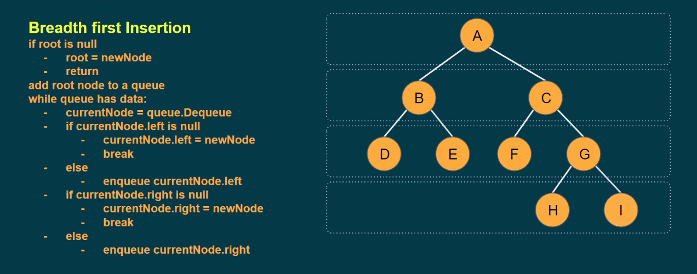

Height: numbers of levels
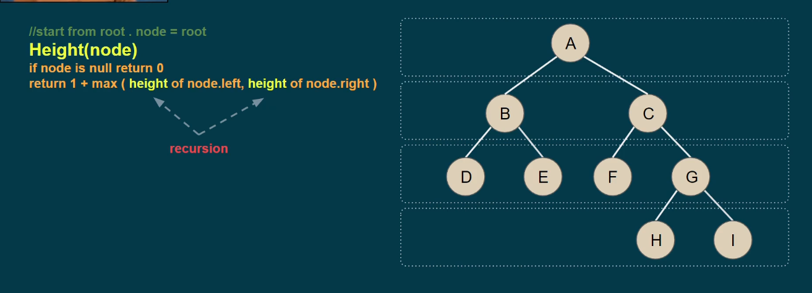
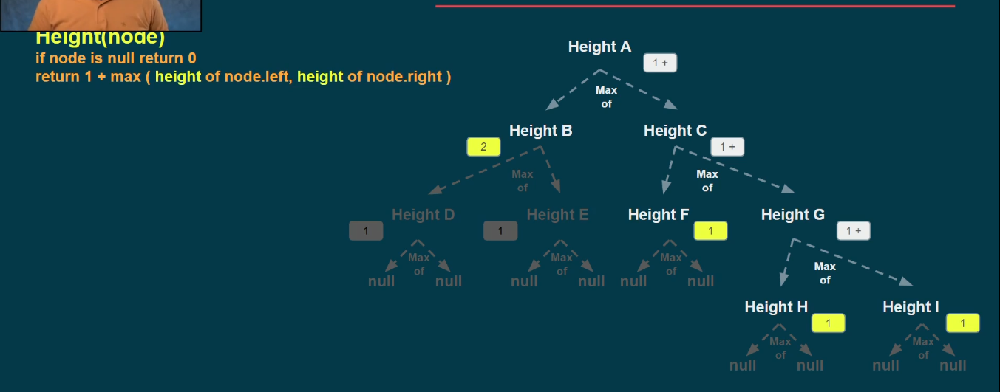
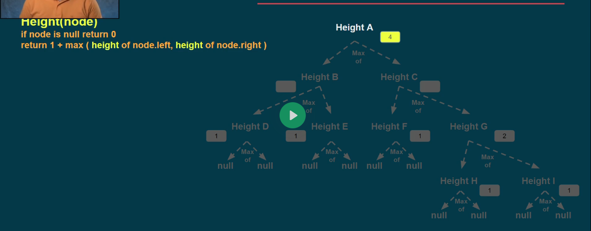

Pre Order Traversal (related to depth not level),
print first and then check left and right
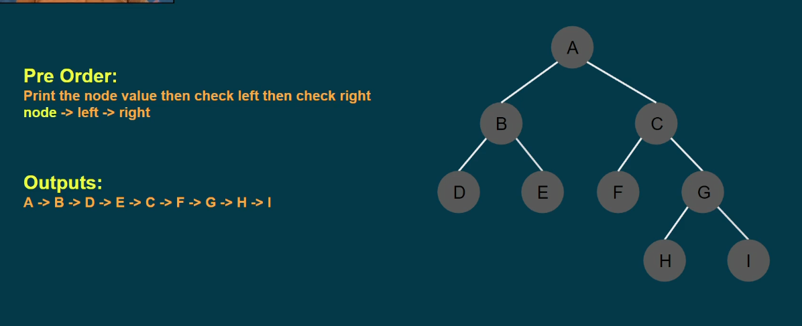

In Order Traversal
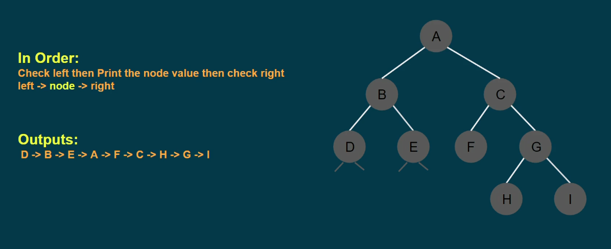

Post Order Traversal
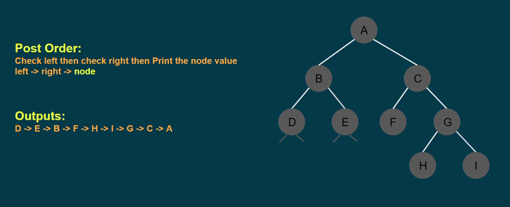

Depth Based Traversal
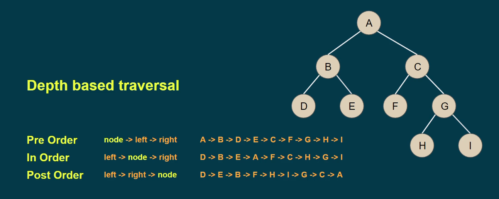

exercise
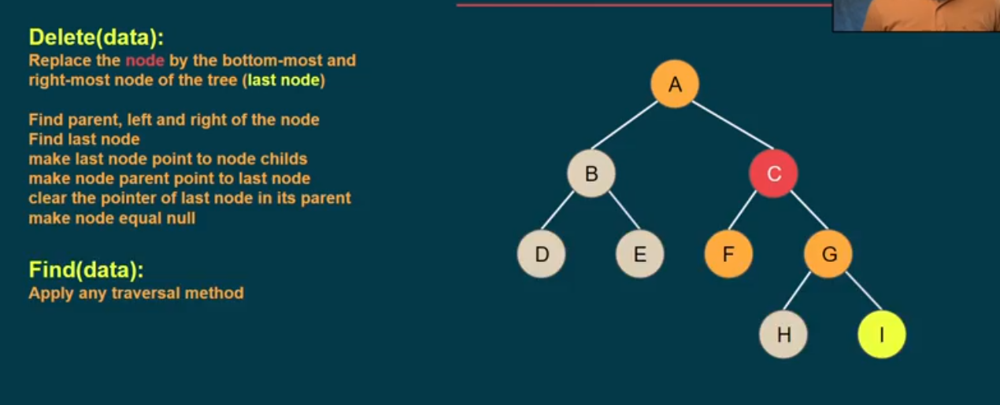
