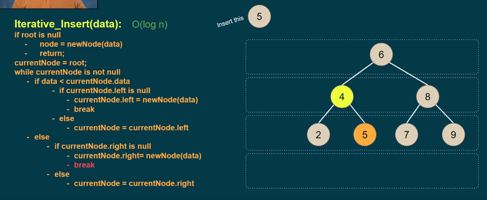
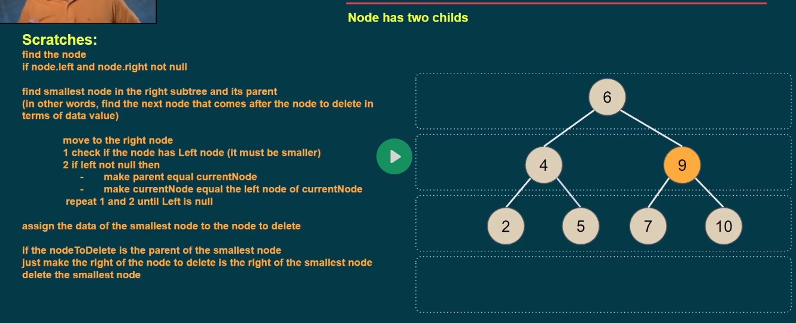
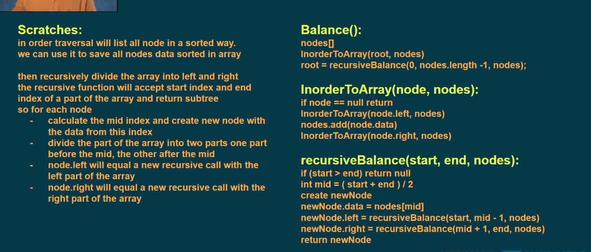

## Binary Search Tree

This properties what makes binary search tree a **binary search tree**.
why: by divide it to levels we make the search **faster**, the number of levels is less than the number of items (n), and the **optimum** number of levels is log(n) (Balanced) but not always.

### Duplication Handling

### Insert

### Find

### Delete

There are three cases

Turn this into Pseudo Code

Node has one child: we delete and replaced 5 by 6 in the below image

Node is a leaf

### Balance

