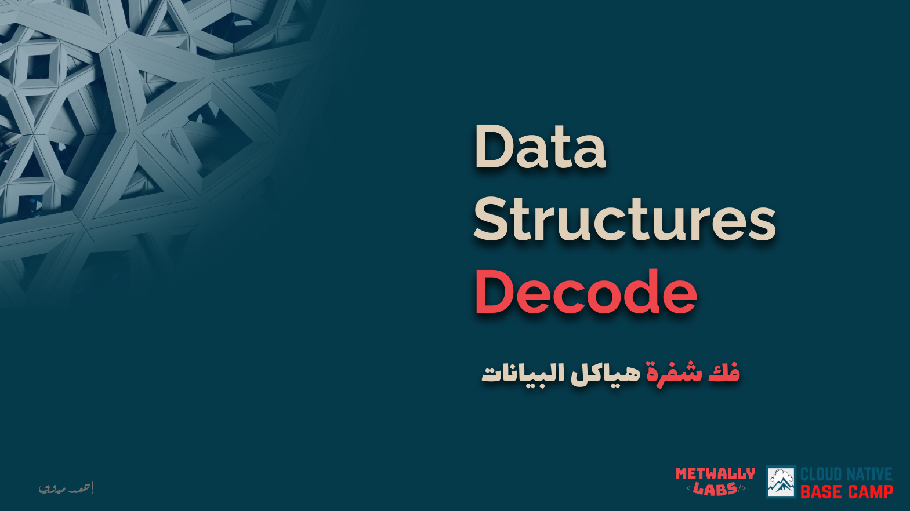

# Data Structures Decode Journey with Ahmed Metwally Course

Welcome to my **personal** repository dedicated to the **"Data Structures Decode"** course led by the instructor **Ahmed Metwally**. This repository serves as my virtual workspace, documenting my progress, solutions, and reflections as I journey through the course. It's a dynamic record of my growth in understanding **data structures** and their applications.

## Purpose of the Repository

This repository is created with a singular purpose - to follow along with Ahmed Metwally's "Data Structures Decode" course. It's my digital companion for the duration of the course, where I'll keep track of the following:

- **Course Material:** I'll organize folders to correspond with each section or module covered in the course, providing a structured layout for easy navigation.
- **Exercises and Solutions:** As I delve into the exercises presented by Ahmed Metwally, I'll document my attempts, thought processes, and final solutions. This not only solidifies my understanding of **data structures** but also allows for future reference.

## How to Navigate

1. **Course Structure:** Folders in this repository are structured according to the course outline. Each folder corresponds to a specific topic or module discussed by Ahmed Metwally, with a focus on key **data structures** such as arrays, linked lists, stacks, queues, and trees.
2. **Exercise Solutions:** Dive into each module folder to find my solutions to the exercises. I'll strive to keep the code clean, well-commented, and efficient.

## Contributions

While this repository is primarily a personal record, I welcome constructive **feedback** and **discussions**. Feel free to open issues if you spot areas of improvement in my code or if you have alternative solutions to the exercises. Let's make this a collaborative space for learning and growth!

## Get in Touch

I'd love to connect with fellow learners, enthusiasts, or anyone interested in data structures and coding. Feel free to reach out:

- **Linkedin:** [Mohammed Abdelmoneim](https://www.linkedin.com/in/m0neim/)
- **Twitter (X):** [@Mohamed_moneim5](https://twitter.com/Mohamed_moneim5)
